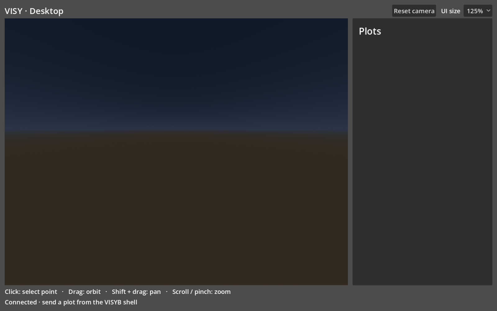
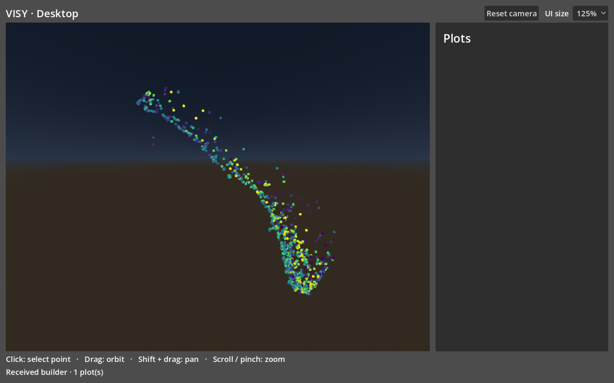
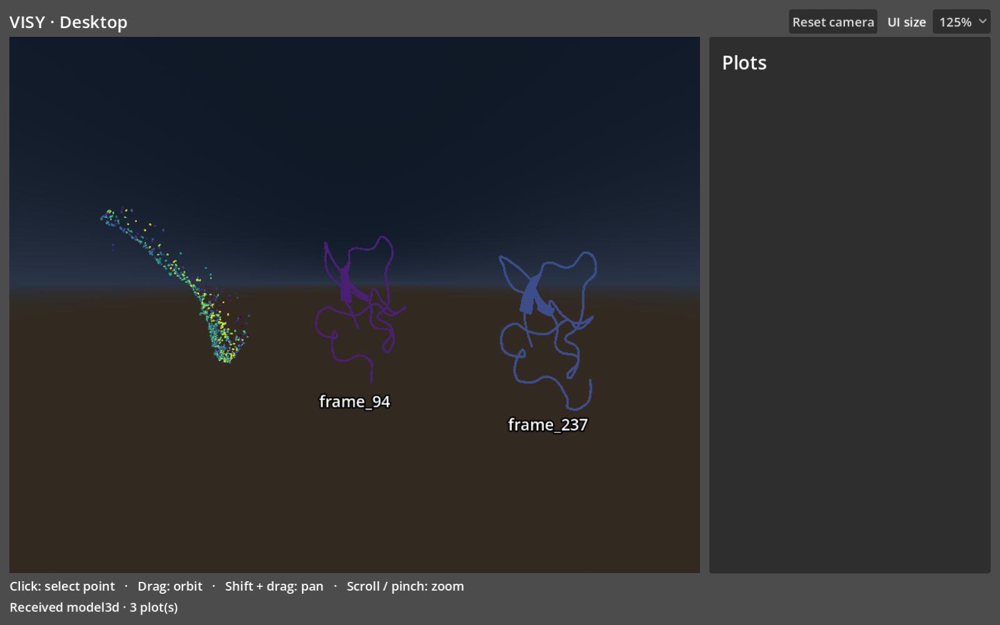
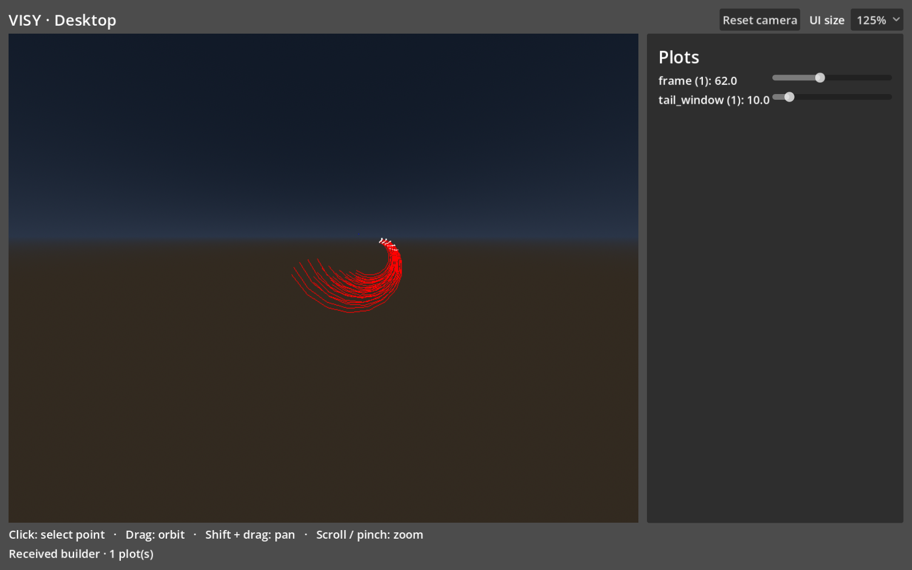
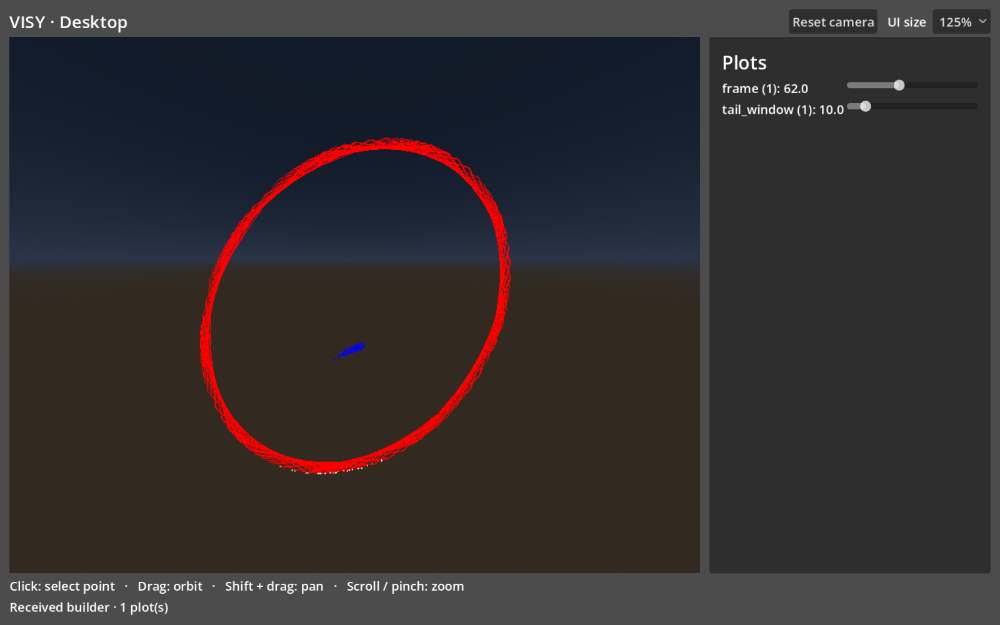
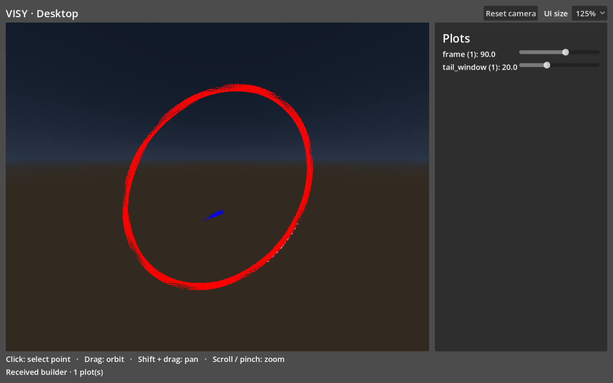
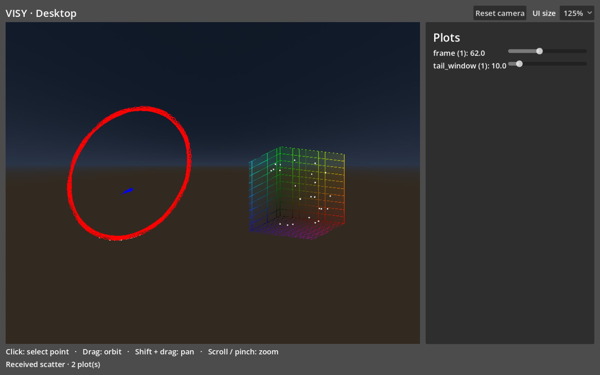

# VISY on macOS: setup and dataset exploration

This tutorial walks through installing VISY's dependencies, starting its Python shell and desktop client, and exploring two examples: **ATLAS protein conformations** and **Kuramoto oscillator trajectories**.

VISY runs the analysis in Python. The Godot client displays the resulting 3D plots and sends selections and parameter changes back to Python. The normal workflow is to load an example in the VISYB shell and explicitly send a plot with `await add_plot(...)`.

The figures below were rendered by the actual VISY desktop scene using the supplied example data. They use Godot **4.6**, a **125% UI scale**, and the parameters shown in the text. Window proportions, plot IDs, and selected frame numbers can differ between sessions.

## 1. Prepare the software and source folders

### Requirements

- A Mac with Homebrew available in Terminal. Check with `brew --version`.
- Matching **desktop-onboarding** source folders for `visyb` and `project-visy`.
- The separately supplied **`visy-desktop-examples.zip`** example archive, saved in Downloads.
- Two Terminal tabs or windows: one for the Python shell and one for Godot.

The example data is distributed separately from the repositories. Keep the archive, extracted datasets, and images derived from them within the same authorized distribution as the examples.

### Install the tools with Homebrew

**In Terminal:**

```bash
brew install --cask miniforge godot
conda init zsh
```

Close and reopen Terminal after initialization. Then check:

```bash
conda --version
godot --version
```

Miniforge provides Conda, which installs the scientific dependencies together in an isolated environment. Homebrew's Godot cask supplies both the application and the `godot` command. See the official [Miniforge cask](https://formulae.brew.sh/cask/miniforge), [Godot cask](https://formulae.brew.sh/cask/godot), and [Conda shell initialization documentation](https://docs.conda.io/projects/conda/en/latest/commands/init.html).

If Conda is already installed and working, keep that installation and run only `brew install --cask godot`. There is no need to install a second Conda distribution.

**Version note:** Homebrew installs its current Godot release, not a fixed version. This tutorial's examples were verified with **Godot 4.6**; a newer Homebrew release has not been verified here. To reproduce the reference version exactly, use the standard macOS build from the [official Godot 4.6 archive](https://godotengine.org/download/archive/4.6-stable/). The `.NET` edition and export templates are not required. If that copy is not on `PATH`, use its `Godot.app/Contents/MacOS/Godot` executable instead of `godot` in the commands below.

### Arrange the source folders

Clone the matching desktop branches into `~/VISY`:

```bash
mkdir -p ~/VISY
cd ~/VISY
git clone --branch desktop-onboarding https://github.com/YaleWTI-CNMI/visyb.git
git clone --branch desktop-onboarding https://github.com/YaleWTI-CNMI/project-visy.git
```

This produces the following layout:

```text
~/VISY/
├── visyb/
│   ├── environment.yml
│   ├── examples/
│   └── visyb/
└── project-visy/
    ├── project.godot
    └── intro_scene_debug.tscn
```

The source repositories are [visyb](https://github.com/YaleWTI-CNMI/visyb) and [project-visy](https://github.com/YaleWTI-CNMI/project-visy). This guide uses their matching **desktop-onboarding** branches. Select these branches explicitly when cloning. Repository access is required if prompted by GitHub.

The commands below assume this directory layout. Substitute the actual parent directory if the source folders are stored elsewhere.

## 2. Create the Python environment

**In Terminal, from the Python repository:**

```bash
cd ~/VISY/visyb
conda env create -f environment.yml
conda activate visyb
python -m pip check
```

The environment file installs Python 3.12, VISYB, NumPy, MDTraj, PyMOL, Matplotlib, and the other required dependencies. Allow the first installation to finish before proceeding.

**Expected result:** `pip check` prints:

```text
No broken requirements found.
```

Check that the active Python belongs to the environment:

```bash
python -c "import sys; print(sys.executable)"
```

The path should point into the `visyb` Conda environment. A bare `pip install visyb` is not a substitute for this step: the ATLAS example also needs the scientific tools supplied by Conda.

For a previously created environment, update it rather than creating another:

```bash
conda env update -n visyb -f environment.yml
conda activate visyb
```

## 3. Import the example archive

Stay in `~/VISY/visyb` with the environment active.

**In Terminal:**

```bash
python -m visyb.prepare_examples ~/Downloads/visy-desktop-examples.zip
```

Use the separately shared ZIP directly; there is no need to unpack it first. The original `visyb.7z` archive is also supported by substituting its path. The command imports only the files needed by these two examples. It prepares ATLAS for headless PyMOL and generates protein models on demand instead of exporting the complete trajectory during startup. Repeating the command preserves existing local files.

**Expected result:** a series of `Preparing …` messages, followed by `Ready:` and the path to `examples/sensitive`.

The directory should contain:

| Example | Files |
| --- | --- |
| ATLAS | `atlas_vr.py`, `1ptq_A.pdb`, `1ptq_A_R1.xtc`, `z_phate_3d_10k.npy` |
| Kuramoto | `kuramoto_vr.py`, `kuramoto_traces_N3_null_omega.pkl`, `kuramoto_traces_N3_skew_omega.pkl` |

These files remain Git-ignored. Load the pickle files only from the trusted example archive. The later `frames/` directory is a generated cache, so it is normal for it not to exist yet.

## 4. Start a VISY session

### Terminal A: start the Python shell

```bash
cd ~/VISY/visyb
conda activate visyb
python -m visyb
```

**Expected result:** a banner beginning with `VISYB Interactive Shell`, followed by an IPython prompt such as:

```text
VISYB Interactive Shell — ws://localhost:8765
...
In [1]:
```

Leave this terminal running. It owns the datasets, plot objects, and local WebSocket server.

From this point, code blocks labeled **VISYB shell** belong at the `In [...]` prompt. Do not copy the prompt itself. `add_plot` and `clear_plots` are already available there.

### Terminal B: start the desktop client

On the first run, import the Godot project's assets:

```bash
cd ~/VISY/project-visy
godot --headless --editor --import --quit
```

Then launch the desktop scene:

```bash
godot --path . res://intro_scene_debug.tscn
```

The explicit scene path is important: **`intro_scene_debug.tscn` is the desktop workspace; `intro_scene.tscn` is the VR scene.**

Alternatively, open Godot, import `~/VISY/project-visy/project.godot`, and press **Play Project / F5**. The desktop-onboarding version selects the desktop scene by default.

**Expected result:** an empty 3D workspace, a **Plots** inspector on the right, and the status **Connected · send a plot from the VISYB shell** at the bottom. An empty workspace at this stage is normal.



*Figure 1. Python and Godot are connected. A plot appears only after it is sent from the shell.*

### Learn the desktop controls

| Action | Control |
| --- | --- |
| Select a point | Click without dragging |
| Orbit the view | Drag with the left mouse button |
| Pan | Shift + drag |
| Zoom | Scroll, or pinch on a trackpad |
| Fit the current workspace | **Reset camera** |
| Enlarge labels and controls | **UI size** → 125% or 150% |
| Remove all plots | `await clear_plots()` in the VISYB shell |

The UI size choice is remembered. Start with 125% and increase it if needed.

## 5. Explore ATLAS protein conformations

### Load the example and display its point cloud

**In the VISYB shell, Terminal A:**

```python
%run examples/sensitive/atlas_vr.py examples/sensitive
atlas = atlas_plot()
await add_plot(atlas)
```

The three lines perform different steps:

1. `%run` loads the example's data and defines its plotting functions.
2. `atlas_plot()` constructs a plot in Python.
3. `await add_plot(atlas)` sends that plot to Godot.

**Expected result:** a curved cloud of **1,000 colored points**, with colors ranging from purple through green to yellow. Each point corresponds to a trajectory frame in a precomputed three-dimensional embedding. The color follows the frame index.



*Figure 2. The first ATLAS view. If only the empty workspace is visible, check that the `await add_plot(atlas)` line was run.*

### Select frames and inspect their structures

Click one point, then a different point. A short click selects; dragging rotates the view.

**Expected result:** Python retrieves each selected frame and generates a protein cartoon. Godot adds each structure beside the point cloud with a caption such as **`frame_94`**. The model color corresponds to the selected frame. The first uncached selection may take longer; generated files are stored in `examples/sensitive/frames/`.

To reproduce the comparison below exactly, use these shell commands:

```python
await clear_plots()
await add_plot(atlas_plot())
await add_plot(model3d_for_index(94))
await add_plot(model3d_for_index(237))
```



*Figure 3. Two frame-specific structures displayed beside the embedding. Mouse selections can produce different frame numbers; the explicit commands above reproduce these two.*

Try orbiting the view to inspect the shapes from another angle. Select points from different parts of the cloud and compare the resulting structures. The models are displayed side by side; this example does not automatically compute a structural alignment or a distance score between them.

The displayed ATLAS frame indices run from **0 to 999**. To inspect another known frame directly, replace the argument in `model3d_for_index(...)` with an index in that range.

## 6. Explore Kuramoto oscillator trajectories

This example visualizes two 5 × 5 patches from an oscillator grid. **Red** trajectories come from the interior patch; **blue** trajectories come from the exterior patch. White points mark the displayed interior endpoints.

### Start with the null-omega dataset

**In the VISYB shell:**

```python
await clear_plots()
%run examples/sensitive/kuramoto_vr.py examples/sensitive/kuramoto_traces_N3_null_omega.pkl
kuramoto = kuramoto_builder_test()
await add_plot(kuramoto)
```

**Expected shell output:** the selected filename and:

```text
x_timeseries shape: (201, 4096, 3)
```

**Expected client view:** short red curved trajectories, white endpoint markers, and two inspector sliders initialized to **frame 62** and **tail_window 10**. The blue exterior trajectories are extremely small in this dataset because that group is almost stationary. Their small size does not mean the dataset failed to load.



*Figure 4. Null-omega at the initial settings. The blue group moves very little compared with the red group.*

### Change the time and trail length

Move either inspector slider:

| Parameter | Effect | Available range |
| --- | --- | --- |
| `frame` | Moves the end of the displayed time window | 5–150 |
| `tail_window` | Changes how many recent samples form each trail | 5–50 |

Godot sends each change to Python. Python rebuilds the plot and returns the updated geometry; the client status changes to **Updated plot …**. The example advances when its parameter changes; it does not automatically play an animation.

For a controlled comparison, hold `frame` fixed and vary `tail_window`, then hold `tail_window` fixed and vary `frame`. A larger tail shows more history where samples are available, although overlapping trajectories can make the difference subtle. Near the beginning of the simulation, the trail stops at the first available sample.

### Compare the skew-omega dataset

Clear the workspace before loading the other variant:

```python
await clear_plots()
%run examples/sensitive/kuramoto_vr.py examples/sensitive/kuramoto_traces_N3_skew_omega.pkl
await add_plot(kuramoto_builder_test())
```

**Expected result:** at frame 62 and tail length 10, the red trajectories form a broad loop, while the blue group forms a smaller visible cluster of trails.



*Figure 5. Skew-omega at frame 62 and tail_window 10. It is easier to see both groups here than in the null-omega example.*

Parameters can also be chosen directly in Python. To reproduce a second view:

```python
await clear_plots()
await add_plot(kuramoto_builder_test(frame=90, tail_window=20))
```

**Expected result:** the inspector starts at **90** and **20**, and the trails change to match the different time window.



*Figure 6. Parameters supplied in Python are reflected in both the plot and the inspector.*

### Open the additional scatter view

Click a white point on the trajectory plot.

**Expected result:** another scatter plot appears beside the trajectories, showing white points within colored coordinate planes. The current example's callback displays the interior patch at the **initial simulation sample**. It is not a detailed view of the particular clicked oscillator or the current slider frame.

The same additional view can be requested explicitly:

```python
await add_plot(kuramoto_plot())
```



*Figure 7. The extra scatter view, shown here beside the default skew-omega trajectory plot. Each new request adds a plot.*

## 7. Reset, switch datasets, and end a session

To clear the current workspace while keeping Python running:

```python
await clear_plots()
```

Then run the appropriate `%run` command again and send a fresh plot. Clear before switching Kuramoto variants: rerunning its script replaces that example's data and functions in the shell.

Closing only Godot leaves Python's plot objects alive. Reopening the client restores them. Exiting Python ends the session; a new shell starts empty.

To finish:

1. Close the Godot client window.
2. Enter `exit` at the VISYB prompt in Terminal A.
3. At the normal Terminal prompt, optionally run `conda deactivate`.

On later visits, repeat **Section 4** and the dataset commands. The environment creation and archive preparation steps are one-time setup.

## Troubleshooting

| Symptom | What to check |
| --- | --- |
| `conda` is missing, or activation fails | Confirm Homebrew's installation completed. Run `conda init zsh`, then open a new Terminal window. |
| `godot` is not found | Run `brew install --cask godot`, or use `/Applications/Godot.app/Contents/MacOS/Godot` if the application is installed there. |
| A source file or scene is missing | Confirm both source folders are the matching desktop-onboarding versions. |
| `No module named …` | Activate `visyb`, check `sys.executable`, and run `python -m pip check`. Use the supplied environment file. |
| The archive or dataset cannot be found | Check the archive path and run preparation from `~/VISY/visyb`. The `%run` paths are relative to that directory. |
| Godot says **Waiting for Python** | Keep `python -m visyb` running. The client connects to `ws://localhost:8765`. |
| Port 8765 is already in use | Exit the other VISYB shell before starting another server. |
| The workspace is empty after `%run` | Run the corresponding `await add_plot(...)` command. Loading a script does not send a plot. |
| An XR initialization error appears | Launch `intro_scene_debug.tscn`, the desktop scene. |
| Points are difficult to select | Zoom in, then click without dragging. **Reset camera** restores the view. |
| Text or controls are too small | Increase **UI size** in the top bar. |
| The blue null-omega trajectories are barely visible | This is expected for the almost stationary exterior group. Compare the skew-omega variant. |
| First import shows controller texture warnings | The inherited VR assets have some missing texture references; they are not used in the desktop workspace. |

The reference setup was validated on an Apple Silicon Mac with Godot 4.6 and Python 3.12. Intel Macs and newer Godot releases were not tested. The existing XR support can also emit tracker diagnostics when Godot exits; the verified desktop examples rendered and exited successfully despite those diagnostics.

---

**Keeping the pictures with the tutorial:** distribute this Markdown file together with the adjacent `visy-desktop-tutorial-assets/` folder. Image paths are relative so the tutorial can be moved as a pair and viewed in a Markdown previewer.
